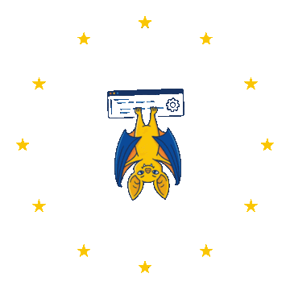

<p align="center">
  <picture>
    <source media="(prefers-color-scheme: dark)" srcset="assets/img/bat-hero-dark.png">
    
  </picture>
</p>

precommitEU is a local-first EU regulatory compliance scanner for source code.
It reads your files, reasons about them against a regulation pack, and reports
the places where the code looks like a violation. Everything runs on your
machine: the scanner starts local `llama-server` processes, talks to them over
localhost, and stops them when the scan ends. No cloud call, no telemetry, no
source code egress.

## Quick start

```bash
brew install llama.cpp
pip install precommiteu "huggingface_hub[cli]"
hf download AlexandruGirlea/precommiteu-models base.gguf gdpr/detector-adapter.gguf --local-dir ~/.precommiteu/models
export PRECOMMITEU_MODELS_DIR=~/.precommiteu/models
precommiteu scan src/
```

`hf` is the Hugging Face downloader, installed on the second line. For Linux,
source builds, GPU builds and air-gapped hosts, see [install.md](install.md).

Two things to know before your first run:

- File discovery skips test and fixture paths (`tests/`, `test/`, `spec/`,
  `fixtures/`, `testdata/`, `e2e/`, and `*_test.*` / `*.spec.*` basenames) and
  prose files such as `docs/`, `README` and `CHANGELOG`. Point a scan at a
  fixture directory and it reports `files_total=0`.
- `precommiteu scan src/ --dry-run` prints the exact file selection and exits
  without loading a model. Use it whenever the scope looks wrong.

The same scan is available from a local web UI. `pip install "precommiteu[ui]"`,
then `precommiteu ui` serves it on `http://127.0.0.1:8787` and opens a browser.
From there you can install what is missing, download a regulation pack, run a
scan and read the findings, one pack at a time. Flags: [cli.md](cli.md).

## Two artifacts, downloaded separately

This is the part people trip over. precommitEU ships as two independent
artifacts.

| Artifact | Source | Size | Fetched by |
|---|---|---|---|
| Scanner | PyPI, `pip install precommiteu` (pure Python wheel) | small | pip |
| Weights | Hugging Face, [AlexandruGirlea/precommiteu-models](https://huggingface.co/AlexandruGirlea/precommiteu-models) (public, no token) | 4.36 GiB base plus ~77 MiB per regulation | `hf download` |

`pip install precommiteu` does **not** fetch the weights. The bundle is one
shared `base.gguf` (Qwen2.5-Coder-7B-Instruct, Q4_K_M) plus one small LoRA
detector adapter per regulation at `<regulation>/detector-adapter.gguf`. Six
regulations therefore cost one base download, not six.

The scanner resolves models from `--models-dir` first, then from
`$PRECOMMITEU_MODELS_DIR`, expecting this layout:

```text
~/.precommiteu/models/
├── base.gguf
└── gdpr/detector-adapter.gguf
```

`--orchestrator-model` and `--detector-adapter` take explicit file paths and
bypass the directory layout. Note that `--detector-adapter` names one adapter,
so it cannot be combined with several regulations: pass it with a single
`--regulations` value, or omit it and let each regulation resolve its own.

## Findings and advisories

A detector proposes candidate violations, then a validator has to locate
verbatim code evidence for each one. If the quoted evidence cannot be found in
the file the candidate is dropped (drop reason `evidence_not_visible`), so a
finding with `source: "precommiteu"` always quotes code that is really there.
A second, smaller class of finding has `source: "retrieval"`: these are
promoted from advisories when the description matches a packaged violation
pattern closely enough, and they carry `code_evidence: null` because no line
was quoted. Only confirmed findings can fail a build, and only with
`--fail-on-findings`.

Advisories are unconfirmed candidates, and they never gate a merge. They are
produced only for files where nothing was confirmed: once a file has a
confirmed finding, its remaining candidates are dropped rather than reported.
Pass `--show-advisories` to print them.

Exit codes: `0` clean · `1` confirmed findings (with `--fail-on-findings`) ·
`2` usage or configuration error · `3` scan incomplete (with
`--fail-on-error`, always on under `--ci`) · `130` interrupted, with partial
reports preserved.

Every file gets a 90 second wall-clock budget. Files routed to the
orchestrator also get a hard cap of 12 agent iterations. The code view sent to
the model is capped at 8000 tokens.

## Incremental rescans

A scan records every file it analysed cleanly. The next scan of the same folder
with the same regulation reads only what changed and replays the rest, so the
second run of a repository that took hours takes minutes. Reused files are
reported as reused, and their findings are replayed into every report, so an
incremental run still produces a complete one.

The record is one small JSON file per folder and regulation under
`~/.precommiteu/scans/`, named from a hash of the absolute path. Nothing is
written into the folder being scanned. `--rescan-all` forces a full pass,
`--scan-log PATH` puts the record elsewhere, and `--ci` keeps none. Change
detection and the exact reuse rules: [cli.md](cli.md#incremental-rescans).

The UI has the same thing on the Target screen: scan only the changed files,
start clean, or forget the cached findings for that folder. Its Settings screen
moves the model bundle, the scan cache and the reports directory, and the next
scan uses the new location without a restart.

## Documentation

| Guide | Contents |
|---|---|
| [Installation](install.md) | Requirements, per-platform install, model bundle download, CPU vs GPU, verify, uninstall |
| [CLI](cli.md) | `precommiteu scan`, `precommiteu ui`, complete flag reference, agent routing, exit codes |
| [Regulation packs](regulations.md) | The six packs, application dates, choosing packs, multi-regulation runs |
| [Suppressions](suppressions.md) | `.eu-ignore`, inline `eu-ignore` directives, audited `precommiteu-ignore` markers |
| [Examples](examples.md) | Worked scans, real output, common flag combinations |
| [CI integration](ci.md) | GitHub Actions, GitLab, Azure DevOps, exit codes, caching the bundle |
| [Python library](library.md) | `scan_paths`, `scan_diff`, result schemas, streaming callbacks |
| [Reports](reports.md) | JSON field reference, SARIF, markdown summary, event ledger |
| [Troubleshooting](troubleshooting.md) | Model paths, `llama-server` startup, empty scans, error messages |

## Ignoring code and suppressing findings

Three mechanisms, in increasing order of auditability:

- **`.eu-ignore`** excludes paths during discovery, so they are never read.
- **Inline `eu-ignore` directives** blank code before the model sees it.
- **`precommiteu-ignore` markers** suppress a confirmed finding and record your
  reason in the JSON and SARIF reports.

Only the marker form leaves a record. Full syntax, matching rules and the audit
workflow: [suppressions.md](suppressions.md).

## Regulation packs

Eight EU regulations, shipped as six adapter packs, scanned one, several or all
at a time.

`gdpr` *(default)* &middot; `eu_ai_act` &middot; `eu_data_act` &middot; `dora`
&middot; `dsa` &middot; `cra_dma_nis2`

```bash
precommiteu scan src/ --regulations gdpr,eu_ai_act
```

Each adapter is trained on code its own regulation governs, so scanning with
all six is noisier rather than more thorough. What each pack covers, when each
regulation applies, and how several run in one scan:
[regulations.md](regulations.md).

## Links

- [precommit.eu](https://precommit.eu), the project site
- [Replay a real scan](https://precommit.eu/try), a recorded GDPR scan step by step, no install
- [Source on GitHub](https://github.com/AlexandruGirlea/precommiteu)
- [Model bundle on Hugging Face](https://huggingface.co/AlexandruGirlea/precommiteu-models)
- [Issues](https://github.com/AlexandruGirlea/precommiteu/issues)

## Disclaimer

Apache-2.0. precommitEU is provided as is, without warranty of any kind. It
produces a compliance signal, not legal advice: it can report findings that are
not violations, and it can miss violations that are present. Nothing it outputs
certifies or evidences compliance with any regulation. Have findings reviewed
by qualified legal counsel before acting on them.
