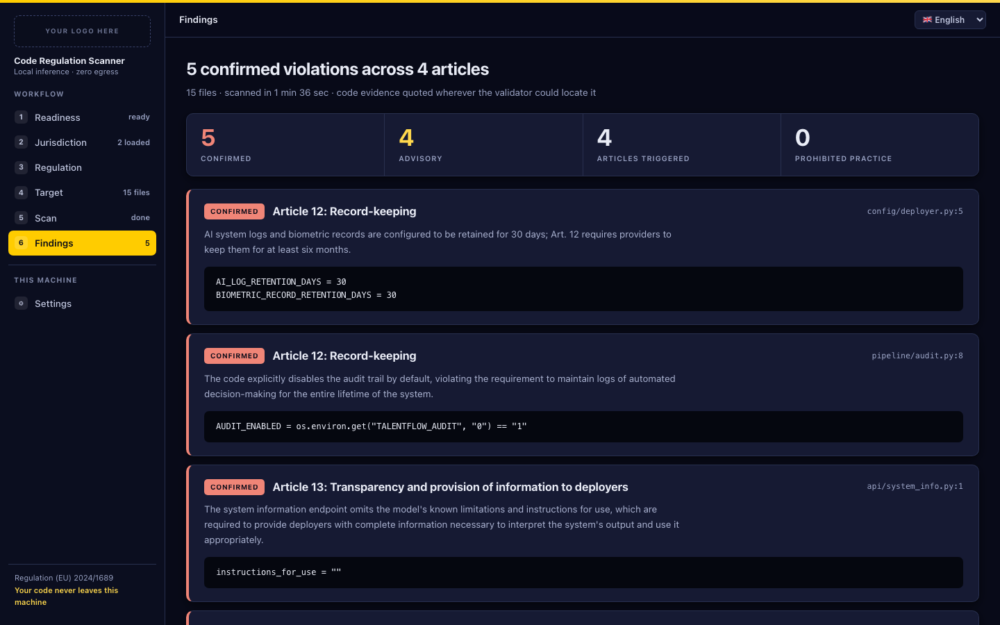
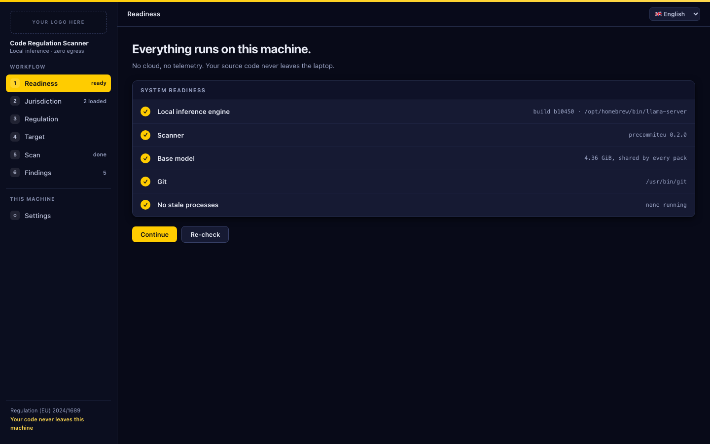
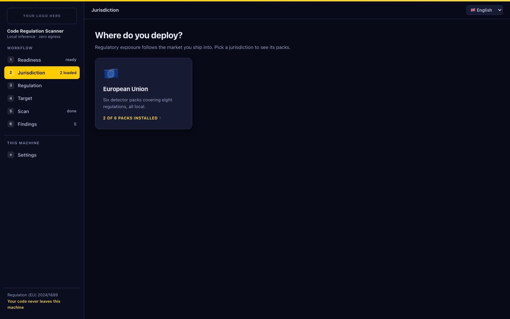
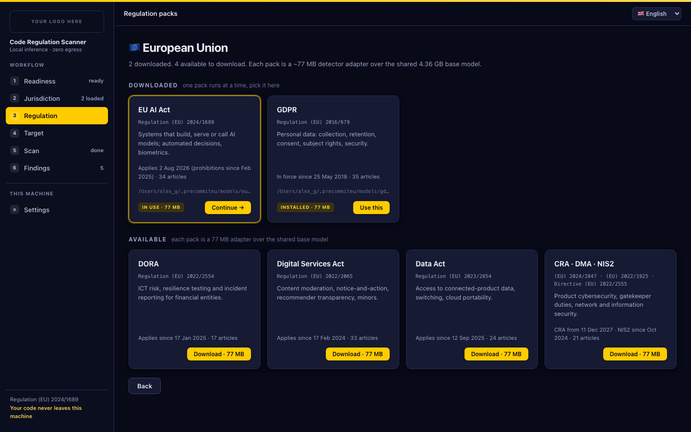
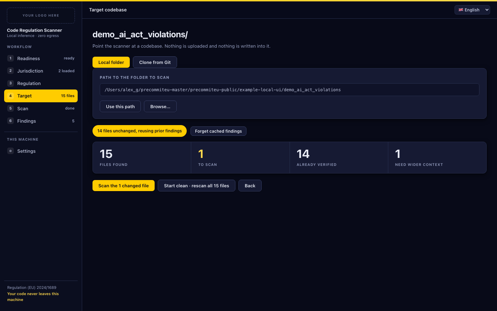
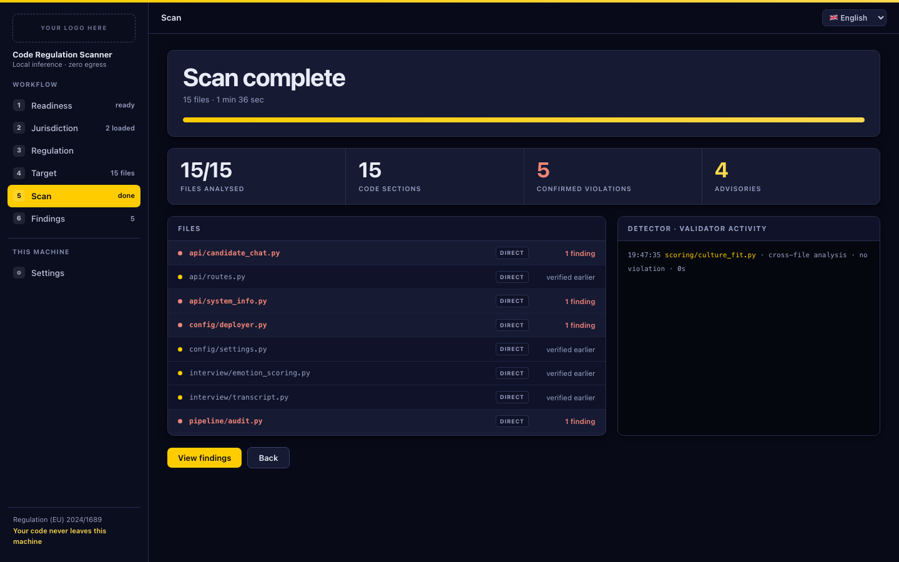

# Local UI

A local web UI ships with the package. It drives the same scanner as a
subprocess, so every result on screen is the result the CLI would produce, and
it writes nothing into the folder being scanned.

```sh
pip install "precommiteu[ui]"
precommiteu ui
```

That serves `http://127.0.0.1:8787` and opens a browser. Nothing is scanned
until you choose a folder. Point it at a folder on this machine, or give it a
repository URL and it clones and scans that.

<p align="center">
  
</p>

The extra pulls `fastapi`, `uvicorn` and `huggingface_hub`. A plain
`pip install precommiteu` for CI is unaffected.

| Flag | Meaning |
|---|---|
| `--port N` | Serve on another port (default `8787`). |
| `--no-browser` | Do not open a browser window. |

## The six steps

The sidebar is the workflow. Steps unlock as you satisfy them, and you can go
back to any step you have already passed.

### 1. Readiness

<p align="center">
  
</p>

Five checks, each with a fix where a fix is possible.

| Check | Blocking | Fix offered |
|---|---|---|
| Local inference engine | yes | The `llama.cpp` install command for your platform, to copy and run |
| Scanner | yes | none needed, reports the installed version |
| Base model | yes | A button that downloads the 4.36 GB shared base |
| Git | no | Reports the path; only `Clone from Git` needs it |
| No stale processes | yes | A button that kills leftover `llama-server` processes |

An unreadable `llama.cpp` version does not block a machine with a working
binary. Only the shared base model belongs here; which regulation adapter you
want is chosen two steps later and downloaded there.

### 2. Jurisdiction

<p align="center">
  
</p>

Pick the market you ship into. The European Union is the only one built today,
covering eight regulations across six packs.

### 3. Regulation

<p align="center">
  
</p>

One pack is active per scan. Packs you have are listed under `Downloaded`,
the rest under `Available to download`.

`Download · 77 MB` fetches that pack's detector adapter. The first download
also fetches the shared 4.36 GB base, so the first one is a 4.4 GB download and
every pack after it is 77 MB. Both are verified against the bundle's
`SHA256SUMS` before the pack is marked installed; a failed checksum reports the
file that failed and the pack stays uninstalled.

A download can be cancelled mid-flight. The partial file stays on disk and the
next attempt resumes from it.

`Use this` makes a downloaded pack the active one. Switching packs is blocked
while a scan is running.

### 4. Target

<p align="center">
  
</p>

Two ways to choose what to scan.

**Local folder.** Type or paste a path, then `Use this path`. On macOS a
`Browse…` button opens the native folder picker. It is hidden on other
platforms, which have no equivalent the server can call, so type the path
there.

**Clone from Git.** An `https://`, `ssh://` or `git@` URL and a destination
directory. The clone is shallow, depth 1, and the scan runs on the clone.
Credential prompts are disabled, so a private URL fails fast instead of
hanging. `Clone` only clones and points the scanner at the result; the scan
itself is the button below.

Four counters describe the plan:

| Counter | Meaning |
|---|---|
| Files found | Everything the scanner would consider in this folder |
| To scan | What actually needs analysing this run |
| Already verified | Unchanged since a previous scan, reused from the scan cache |
| Need wider context | Files that reference a sibling, so the orchestrator handles them |

When some files are unchanged the primary button becomes `Scan the N changed
files` and `Start clean · rescan all N files` appears next to it.
`Forget cached findings` deletes the scan cache for this folder and pack only,
so the next run analyses everything again. See
[Incremental rescans](cli.md#incremental-rescans) for the reuse rules.

### 5. Scan

<p align="center">
  
</p>

A countdown, a progress bar, and four live counters: files analysed, code
sections, confirmed violations, advisories. The left panel lists every file
with its route and outcome; the right panel is the detector and validator
activity log.

Two ways to interrupt, and they are not the same:

| Button | Effect |
|---|---|
| `Pause · keep results` | Interrupts the scan. Everything analysed so far is kept and `Resume` continues from there. |
| `Stop · clear results` | Interrupts the scan and discards its results and scan cache for this folder. |

Pause sends an interrupt to the scanner and waits for it to wind down before
escalating, so a paused scan leaves no half-written report.

The first run of a pack loads the model before any file is analysed. The UI
shows this as a loading phase and learns how long your machine takes, so later
estimates are closer.

On macOS the scan holds the machine awake while it runs.

### 6. Findings

<p align="center">
  
</p>

Confirmed violations first, each with the article, the file and line, the
reasoning, and the verbatim code evidence it was confirmed against. Advisories
follow: candidates the validator could not confirm. They are informational and
never affect an exit code.

`Export report` opens the reports directory, where every run leaves a JSON
result, a SARIF file, a markdown summary, an event ledger and a log. On
platforms without a Finder-style reveal, open the path from
[Settings](#settings) directly. Field reference:
[Reports](reports.md).

`Clear results` discards the findings and the scan cache for this folder and
pack.

## Settings

Three directories, each changeable without a restart. The next scan uses the
new location.

| Setting | Default | Holds |
|---|---|---|
| Model bundle | `~/.precommiteu/models` | The base model and the adapter of every pack you downloaded |
| Scan cache | `~/.precommiteu/scans` | One small JSON file per folder and pack, recording what was already analysed |
| Reports | `~/.precommiteu-ui/runs` | JSON, SARIF, markdown, ledger and log for every run |

A path must be an existing writable directory, or a new one inside your home
directory, which the UI creates for you. Changes are refused while a scan or a
download is running. Your choices are stored in
`~/.precommiteu-ui/settings.json`; deleting that file restores the defaults.

Moving the model bundle does not move your files. Point it at a directory that
already holds a bundle, or download the packs again.

## Language

The interface is available in English, Romanian, German, French and Italian,
chosen from the toolbar. It defaults to your browser's language and remembers
the choice. Findings text comes from the model and is not translated.

## What leaves the machine

Nothing, unless you ask for it. The server binds to `127.0.0.1` only, pins the
`Host` header, refuses cross-origin writes and denies framing. It contains no
telemetry and no update check.

Two actions reach the network, both of them started by you: downloading a
model pack from Hugging Face, and cloning a repository from a URL you typed.
Scanning itself talks only to a `llama-server` on loopback, and it deliberately
bypasses any `HTTP_PROXY` set in your environment so your source cannot be
routed through a proxy.

## Troubleshooting

**The port is already in use.** Another instance is running. Use it, or start
this one with `--port`.

**Readiness says stale processes and no scan is running.** A previous scan
died and left `llama-server` behind. The fix button kills them. It matches by
process name, so if you are deliberately running two UIs at once it will offer
to kill the other one's scan too.

**A download failed.** The panel shows the error and keeps the partial file.
Retrying resumes. A checksum failure names the file that failed; retry, and if
it repeats, delete that file from the model bundle directory and download
again.

**The interface looks wrong after upgrading.** The browser cached the previous
version. Hard reload the page.

**A pack downloaded but readiness still blocks.** The adapter is 77 MB and the
base is 4.36 GB, so the adapter lands long before the base. Wait for the
download to finish.

For scanner behaviour rather than interface behaviour, see
[Troubleshooting](troubleshooting.md).
